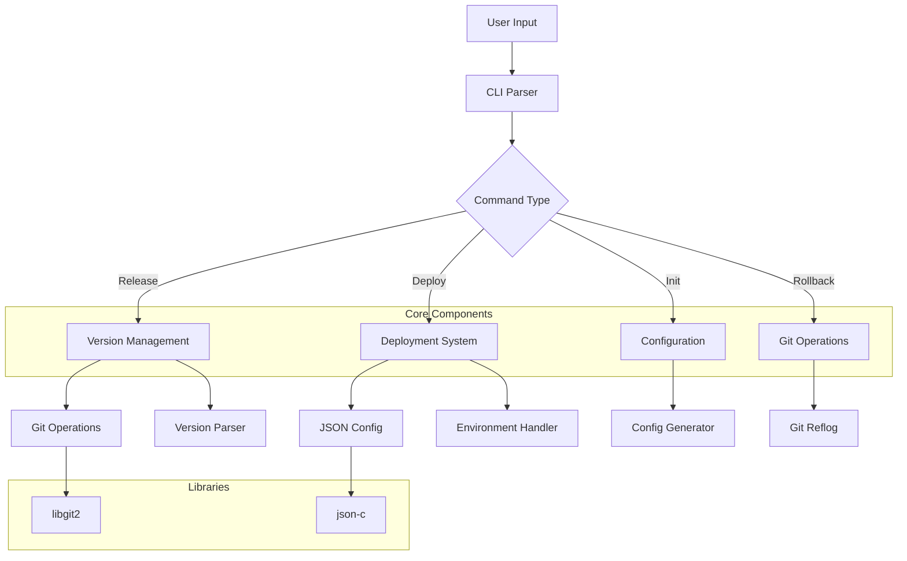

# Releasy

A spicy CLI wrapper for Git releases and painless deployments.


## Features

- 🏷️ Semantic versioning with validation
- 🔄 Git tag management using libgit2
- 🚀 Configurable deployment pipelines
- 🔐 GPG signing integration
- 🔄 CI/CD pipeline hooks
- 💻 Cross-platform support
- 🛠️ Systemd service integration



## Architecture

Releasy follows a modular architecture with the following components:

- **Version Management** (`semver.h/c`): Handles semantic versioning parsing and validation
- **Git Operations** (`git_ops.h/c`): Manages git repository operations using libgit2
- **Deployment Logic** (`deploy.h/c`): Handles deployment pipeline execution
- **Configuration** (`config.h/c`): Manages JSON-based configuration
- **UI/Interactive** (`ui.h/c`): Handles user interaction and prompts

## Building from Source

### Prerequisites

- C compiler (GCC/Clang)
- CMake (>= 3.13)
- pkg-config
- libgit2 development files
- json-c development files

### On Debian/Ubuntu

1. Install dependencies:
```bash
sudo apt-get install -y build-essential cmake pkg-config libgit2-dev libjson-c-dev
```

2. Build the project:
```bash
mkdir build
cd build
cmake ..
make
```

3. Install (optional):
```bash
sudo make install
```

### On Other Systems

Ensure you have equivalent packages installed for your system's package manager.

## Testing

Releasy includes comprehensive tests for each component:

```bash
# Build and run tests
cd build
make
./test_semver          # Run semantic version tests
./test_git_ops .       # Run git operations tests
```

## Usage

Basic usage pattern:

```bash
# Show help
releasy --help

# Initialize in a repository
releasy init

# Create a new release
releasy release

# Deploy to an environment
releasy deploy --env production

# Rollback to previous version
releasy rollback
```

### Configuration

Releasy can be configured through:
- Command line arguments
- Configuration file
- Environment variables
- Interactive prompts

## Contributing

We welcome contributions! Here's how you can help:

1. Fork the repository
2. Create a feature branch
3. Make your changes
4. Write/update tests
5. Update documentation
6. Submit a pull request

### Coding Style

- Follow BSD-style function comments (PLZ)
- Ensure memory management is valgrind-clean
- Add comprehensive error handling

### Commit Style

Follow conventional commit format:
```
type(scope): description

[optional body]

[optional footer]
```

Types:
- feat: New feature
- fix: Bug fix
- docs: Documentation
- style: Formatting
- refactor: Code restructuring
- test: Adding tests
- chore: Maintenance

## License

MIT License - see [LICENSE](LICENSE) for details

## Authors

- Fayssal Chokri

## Acknowledgments

- libgit2 team
- json-c developers
- Open source community
